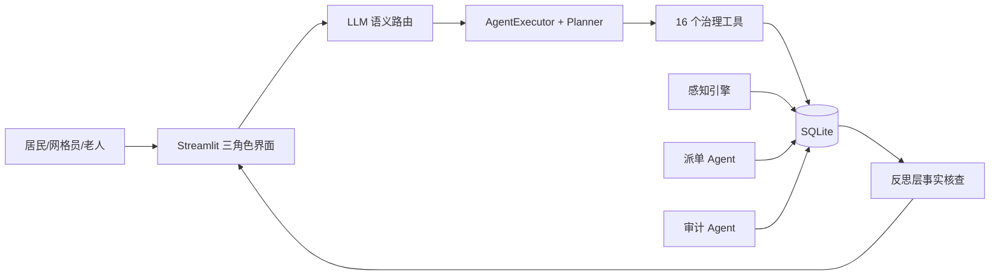

# 智能体创意说明书

## 一、项目基本信息

### 1. 项目名称

**社区先知 CommunityInsight Agent**（基层治理智能体）

### 2. 团队成员信息表

| 序号 | 姓名 | 身份证号 | 专业 / 学历 | 院校 | 团队职责 | 学生证扫描件 | 备注 |
| ---- | ---- | -------- | ----------- | ---- | -------- | ------------ | ---- |
| 1    | 步承泽 | 110113200604194512 | 大数据管理与应用 / 本科 | 北京工商大学 | 项目负责人（架构设计 / Agent 内核 / 全栈开发 / 数据与测试） | （附件待附） | 单人参赛，独立完成 |

> 本项目为**单人参赛**（2-5 人组队允许范围内独立完成全部研发工作）。

### 3. 参赛方向（勾选）

- [ ] 产业赋能
- [ ] 政企服务
- [x] **基层治理**
- [ ] 文创艺术
- [ ] 科教创新

### 4. 项目负责人信息

- 姓名：步承泽
- 联系电话：（请补充）
- 电子邮箱：（请补充）

---

## 二、项目概述（≤300 字）

基层治理的"接诉即办"长期面临三个痛点：**诉求处理不透明**（居民上报后无人跟进、办结进度不可见）、**时效无保障**（无 SLA 分级与超时预警）、**独居老人安全真空**（老人失联数日无人知晓，只能靠邻居偶然发现）。

本项目构建一个**多智能体协同的社区治理 Agent**：感知层实时监测工单热点、恶劣天气、老人活跃度；理解层由大模型语义判断居民诉求并自动分类定级；决策层自主规划工具调用（上报、查单、派单、附议）；执行层对接 16 个治理工具；反馈层对大模型输出做事实核查与幻觉拦截。面向**居民、网格员、独居老人**三角色提供差异化界面：居民一句话上报诉求并追踪闭环，网格员工作台处理 SLA 工单与满意度复核，老人使用大字关怀版一键呼叫、SOS 求助与每日平安打卡。

预期落地价值：让"接诉即办"从登记制升级为**可追踪、有时效、能闭环**的数字化流程，并为独居老人提供"无人应答即预警"的安全兜底，可复制到街道/社区推广。

---

## 三、智能体架构与技术实现（核心）

### 1. 整体架构逻辑

**① 智能体架构范式：多智能体协同 + 自主循环 Agent**

采用 **OODA 自主循环**（Observe-Orient-Decide-Act-Reflect）为主干，叠加**多智能体分工**：感知 Agent（Observer，实时监测）、派单 Agent（Dispatcher，主动派发）、审计 Agent（Auditor，跨表治理体检），由主对话 Agent 编排协同。

**② 核心模块（五层 + 人机交互层）**

| 层 | 模块 | 职责 | 代码位置 |
|----|------|------|---------|
| 感知层 | PerceptionMonitor + Reflector | 天气/工单热点/老人活跃度监测、z-score 异常检测、SLA 超时/升级识别 | `perception/monitor.py`、`agent/reflector/` |
| 理解层 | LLM 语义路由 | 大模型判断意图与工具（置信度 + 澄清机制），关键词表仅作快路径/兜底 | `agent/router.py` |
| 决策层 | AgentExecutor + Planner | 大模型自主规划工具调用顺序，Plan-and-Execute 执行复合任务 | `agent/engine.py`、`agent/planner.py` |
| 执行层 | 16 个治理工具 | 上报工单、查询、派单、提案、附议、议题、天气、知识库 | `tools/` |
| 反馈层 | Reflection + Enforce | 大模型输出事实核查（编号/数值/语义）、幻觉工单强制拦截 | `agent/reflection.py`、`agent/enforce.py` |
| 人机交互层 | Streamlit 三角色 | 居民端 / 网格员端 / 老年关怀版（大字高对比 + 语音 + TTS） | `ui/`、`ui/pages_grid/`、`ui/pages_elderly/` |

**③ 整体运行逻辑与数据流向**

```
用户输入 → 感知上下文注入（天气/热点/老人状态）
        → LLM 语义路由（意图 + 工具 + 是否需要追问）
        → AgentExecutor 自主规划调用工具（或 Plan-and-Execute 快路径）
        → 工具写入 SQLite（工单/提案/派单/通知）
        → 反思层事实核查（编号/数值/语义一致性）
        → 主动闭环（未解决工单提醒 / 老人未打卡预警 / SLA 升级）
        → 生成回复（文本 / TTS 朗读）
```

### 2. 智能体工作流设计

**① 输入源**（合规说明）

| 输入源 | 说明 | 合规 |
|--------|------|------|
| 文本 | 居民自然语言诉求 / 对话 | 无真实个人信息（演示用 seed 数据） |
| 语音 | 老年版 Web Speech API 录音 → 文本 | 浏览器本地识别，不上传 |
| 知识库 | 社区政策 / 指南 / 电话（TF-IDF 语义检索） | 公开常识性内容 |
| 感知数据 | 工单表 / 天气 API / 老人活跃度 | 天气用和风 API（免费授权） |

**② 处理流程**

- **大模型选型**：DeepSeek（openai 兼容，function calling 支持）
- **提示词工程**：系统提示注入角色上下文 + 工具使用原则（按语义选工具，不依赖穷举触发词）
- **知识库构建**：社区知识条目（分类/关键词），TF-IDF 向量化语义检索
- **工具调用**：LangChain AgentExecutor（ReAct）+ 16 个函数工具 + 角色化工具裁剪（老年角色仅 4 个工具）
- **自动化节点**：感知周期触发 → 自动派单 → SLA 升级 → 老人平安打卡检测

**③ 输出形态**

文本生成（对话回复）/ 工单生成（数据落库）/ 指令执行（派单、状态流转）/ 接口调用（天气 API）/ 可视化呈现（治理看板、KPI、图表）/ TTS 语音播报（老年版）

**④ 标准流程图 / 架构图**



### 3. 人机协同边界设计

**① 智能体自动执行环节**

- 居民诉求的意图理解、自动分类定级、工单生成
- 主动派单（按类别→责任部门→网格员，自动写入 assignee）
- SLA 超时/升级自动识别与预警
- 独居老人超过 24 小时未互动 → 自动通知网格员
- 用药提醒到点推送、"我已吃"确认记录

**② 人类监督 / 审核 / 决策环节**

- 网格员确认工单处理、填写处理备注、指派处理人
- 满意度「不满意」进入**待复核**状态，由网格员确认重开或驳回（防刷单）
- SOS 紧急求助由网格员处置并标记"已处理"
- 老人健康档案、用药提醒设置由家属/网格员协助录入

**③ 安全与合规校验机制**

- 防幻觉安全网 `enforce_tool_call`：大模型声称"已上报"但未调工具时强制真实调用
- 事实核查 `reflection`：回复中的工单编号/数值与数据库比对，异常自动修正
- 角色权限守卫：网格员页面 `require_role` 拦截越权；账号切换仅演示模式开放
- API 鉴权：`COMMUNITY_API_KEY`（生产环境强制）
- 三层回退链（大模型 → 离线规则 → 静态兜底），保证服务永不白屏

### 4. 架构创新点

**① 对比通用方案的创新**

| 维度 | 通用方案 | 本项目 |
|------|---------|--------|
| 意图理解 | 关键词/意图分类器 | **大模型语义路由**（置信度 + 澄清机制），关键词仅兜底 |
| 决策 | 固定工作流编排 | **大模型自主规划工具调用**（OODA 循环） |
| 反幻觉 | 无/简单过滤 | **双层防线**：工具调用强制 + 事实核查（编号/数值/语义） |
| 可靠性 | 单一大模型 | **三层回退链**，离线规则/静态兜底永不白屏 |
| 角色适配 | 单一界面 | **三角色差异化**（居民/网格员/老人），老年大字高对比 + 语音 |

**② 可复用、可迁移、可规模化**

- 工具注册自动化（`tools/__init__.py` 自动扫描），新增能力零配置接入
- 版本化数据库迁移（schema v1~v10，失败即报错），可迁移到任意环境
- 场景叙事（海淀小区）与业务逻辑解耦，可复制到其他街道/社区

**③ AI 原生与智能体规范符合性**

- 符合"感知-决策-执行-反思"的自主 Agent 范式
- 人机协同边界清晰（自动 vs 人工审核），符合基层治理的权责要求
- 数据合规遵循《个人信息保护法》，演示数据无真实个人信息

---

## 四、产业 / 场景应用说明

### 1. 精准应用场景（垂直细分）

- **接诉即办**：居民一句话上报诉求 → 自动分类定级 → 生成工单 → 派单 → 处理 → 满意度评价闭环
- **独居老人关怀**：平安打卡（超时预警）、SOS 紧急求助、吃药提醒、一键呼叫子女/网格员/急救
- **邻里议事**：提案创建/附议/议题讨论 → 网格员回应/采纳

### 2. 目标问题与现有方案痛点

| 痛点 | 现有方案（热线/人工登记/微信群） | 本项目 |
|------|-------------------------------|--------|
| 诉求处理不透明 | 电话登记后无跟进 | 工单全流程可追踪 |
| 时效无保障 | 无 SLA 概念 | 分级时效（极急6h/紧急24h/普通72h）+ 超时升级 |
| 分类定级靠人工 | 人工判断慢、口径不一 | 大模型自动分类 + 关键词兜底 |
| 独居老人安全真空 | 靠邻居偶然发现 | 每日平安打卡 + 超时预警 + SOS |

### 3. 智能体提效 / 降本 / 提质 / 风控价值

- **提效**：诉求自动分类定级，免去人工登记与分拣；自动派单直达责任网格员
- **降本**：减少热线人工坐席与台账维护
- **提质**：SLA 分级 + 超时预警 + 满意度闭环，倒逼处置时效
- **风控**：防幻觉安全网防止"假工单"；独居老人安全预警兜底

### 4. 适配区域 / 社区落地路径

海淀小区试点（现有完整 seed 数据与叙事）→ 街道推广（场景叙事与业务解耦，可换城市/社区）→ 多社区多租户（数据库按社区隔离）。

---

## 五、可运行性与落地可行性

### 1. 原型状态

- [ ] 无原型
- [ ] 概念原型
- [ ] 可交互 Demo
- [x] **可部署版本**（Streamlit 应用 + Docker 镜像 + 一键安装包）

### 2. 已完成验证

- [ ] 未测试
- [x] **内部测试**（328 项自动化测试全绿，含单元/集成/端到端/语义兜底/老年关怀/派单测试）
- [ ] 小范围试用
- [ ] 场景试点

> 另附：Agent 竞争力评测报告（意图路由泛化命中率，LLM 版实测；幻觉检出率 100%）。

### 3. 核心技术栈与依赖工具

| 层 | 技术 |
|----|------|
| 前端 | Streamlit（多页 + 三角色）+ 自研 Design Token 设计系统 |
| Agent | LangChain（AgentExecutor + 工具）+ DeepSeek（大模型） |
| 数据 | SQLite（版本化迁移 v1~v10）+ TF-IDF 知识检索 |
| API | FastAPI（对外 REST，供第三方/大模型工作流接入） |
| 语音 | Web Speech API（ASR/TTS，渐进增强） |
| 运维 | Docker / docker-compose / Streamlit Cloud / CI（GitHub Actions，328 测试） |

### 4. 落地所需条件

- **数据**：社区诉求数据（脱敏）、知识库内容
- **算力**：DeepSeek API（按量付费，成本可控；离线模式零成本）
- **接口**：DeepSeek、和风天气（免费）
- **权限**：社区治理部门配合、网格员账号体系
- **合作方**：街道办/社区居委会（场景与数据）

### 5. 风险点与应对方案

| 风险 | 应对 |
|------|------|
| 线上演示数据会重置（Streamlit Cloud 文件系统临时） | 已在 README 声明；生产环境迁移 PostgreSQL/Supabase |
| 大模型偶发幻觉/不稳定 | 三层回退链 + 防幻觉安全网 + 事实核查；离线规则 100% 兜底 |
| 语音识别依赖浏览器 | Web Speech API 渐进增强，不支持时自动降级文字输入 |
| 真实运营需真人网格员 | 人机协同边界明确：派单/SLA/复核均需网格员确认 |

---

## 六、合规与知识产权

### 1. 数据来源与合规说明

- 演示数据全部为**程序生成的 seed 数据**（虚构的居民/工单/提案），**不含任何真实个人信息**
- 符合《个人信息保护法》《数据安全法》要求
- 知识库内容为公开的社区治理常识性信息

### 2. 第三方资源授权情况

| 资源 | 授权 |
|------|------|
| DeepSeek API | 官方 API，按官方条款使用（key 存于 .env，不提交） |
| 和风天气 API | 免费开发者计划 |
| 开源库 | Streamlit / LangChain / FastAPI 等均遵循开源协议 |

### 3. 知识产权规划

- [ ] 专利
- [x] **软著**（候选：Agent 编排逻辑与治理工具集）
- [ ] 商标
- [ ] 无

---

## 七、附件材料

1. 智能体架构图 / 工作流程图（见第三章 Mermaid，可转图片）
2. 原型界面截图（三角色：居民对话页 / 网格员工作台 / 老年关怀版——附件待附）
3. 测试数据 / 效果对比（328 项测试全绿 + Agent 评测报告 `agent/eval/report.md`）
4. 知识产权证明（可选，待办）
5. 其他支撑材料（README / CHANGELOG / 技术文档）
