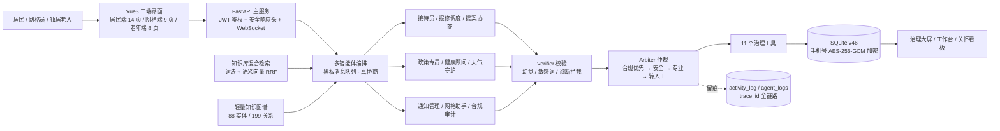

# 智能体创意说明书

## 一、项目基本信息

### 1. 项目名称

**社区先知 CommunityInsight Agent**（基层治理智能体）

### 2. 团队成员信息表

| 序号 | 姓名 | 身份证号 | 专业 / 学历 | 院校 | 团队职责 | 学生证扫描件 | 备注 |
| ---- | ---- | -------- | ----------- | ---- | -------- | ------------ | ---- |
| 1    | 步承泽 | 110113200604194512 | 大数据管理与应用 / 本科 | 北京工商大学 | 项目负责人（架构设计 / Agent 内核 / 全栈开发 / 数据与测试） | （附件待附） | 单人参赛，独立完成 |

> 本项目为**单人参赛**（2-5 人组队允许范围内独立完成全部研发工作）。

### 3. 参赛方向（勾选）

- [ ] 产业赋能
- [ ] 政企服务
- [x] **基层治理**
- [ ] 文创艺术
- [ ] 科教创新

### 4. 项目负责人信息

- 姓名：步承泽
- 联系电话：15313950893
- 电子邮箱：1803801843@qq.com

---

## 二、项目概述（≤300 字）

基层治理的"接诉即办"长期面临三个痛点：**诉求处理不透明**（居民上报后无人跟进、办结进度不可见）、**时效无保障**（无 SLA 分级与超时预警）、**独居老人安全真空**（老人失联数日无人知晓，只能靠邻居偶然发现）。

本项目构建一个**多智能体协同的社区治理 Agent**：感知层实时监测工单热点、恶劣天气与老人活跃度；理解层用确定性规则识别诉求（同义/方言归一），模糊时由大模型闭集兜底；协作层由 **9 个声明式角色在黑板上多轮真协商**，完成上报、派单、议事、通知等 **11 类治理工具**调用；反馈层以 **Verifier（幻觉/诊断拦截）+ Arbiter（仲裁留痕）双层防线**守住可信，必要时转人工。面向**居民、网格员、独居老人**提供三端差异化界面：居民一句话上报诉求并追踪闭环，网格员工作台处理 SLA 工单与满意度复核，老人使用大字关怀版一键呼叫、SOS 求助与用药提醒。

预期落地价值：让"接诉即办"从登记制升级为**可追踪、有时效、能闭环**的数字化流程，并为独居老人提供"无人应答即预警"的安全兜底，可复制到街道/社区推广。

---

## 三、智能体架构与技术实现（核心）

### 1. 整体架构逻辑

**① 智能体架构范式：多智能体协同 + 自主循环 Agent**

采用 **OODA 自主循环**（Observe-Orient-Decide-Act-Reflect）为主干，叠加**多智能体分工**：感知 Agent（Observer，实时监测）、派单 Agent（Dispatcher，主动派发）、审计 Agent（Auditor，跨表治理体检），由主对话 Agent 编排协同。

**② 核心模块（五层 + 人机交互层）**

| 层 | 模块 | 职责 | 代码位置 |
|----|------|------|---------|
| 感知层 | 天气守护 / 网格助手 / 关怀巡检 | 天气与预警、工单热点、老人活跃度与久未互动、SLA 超时与升级识别（定时任务） | `agent/roles/auto_agents.py`、`scripts/scheduler.py` |
| 理解层 | 接待员（规则为骨 + LLM 兜底） | 同义词/方言归一 + 指代与否定处理识别意图；模糊时 LLM 闭集兜底（8 类白名单） | `agent/roles/business_agents.py`、`agent/intent_llm.py` |
| 协作层 | 黑板 + 编排器 | 9 个声明式角色在共享黑板上收发消息，**跨角色多轮真协商**（如 天气⇄健康→通知） | `agent/blackboard.py`、`agent/orchestrator.py` |
| 决策层 | 业务角色（5）+ 专家角色 | 报修调度、提案协商、政策专员、健康顾问、通知管理各自决策并回写状态机 | `agent/roles/business_agents.py` |
| 执行层 | **11 个治理工具** | 上报工单、查询工单/我的工单、派单、提案、附议、议题、天气、社区脉搏、知识库 | `tools/` |
| 反馈层 | **Verifier + Arbiter 双层防线** | 幻觉/敏感词/手机号/医疗诊断句式拦截 → 合规优先·安全·专业·转人工仲裁并留痕 | `agent/verifier.py`、`agent/arbiter.py` |
| 人机交互层 | **Vue3 三端** | 居民端 14 页 / 网格端 9 页 / 老年端 8 页（大字高对比 + 语音 + TTS + 免登录） | `web/src/views/{resident,grid,elderly}/` |

**③ 整体运行逻辑与数据流向**

```
用户输入 → 上下文注入（天气/热点/老人状态 + 会话实体）
        → 接待员识别意图（同义/方言归一 → 规则优先 → LLM 闭集兜底）
        → 编排器派发到对应角色，黑板消息队列驱动**跨角色多轮协商**
        → 角色调用治理工具写入 SQLite（工单/提案/派单/通知/关怀记录）
        → Verifier 校验（幻觉/敏感词/手机号/诊断）→ Arbiter 仲裁（必要时转人工）
        → 主动闭环（未解决工单提醒 / 老人未打卡预警 / SLA 升级 / 办结回访）
        → 生成回复（文本 / TTS 朗读）+ 全链路 trace_id 留痕
```

### 2. 智能体工作流设计

**① 输入源**（合规说明）

| 输入源 | 说明 | 合规 |
|--------|------|------|
| 文本 | 居民自然语言诉求 / 对话 | 无真实个人信息（演示用 seed 数据） |
| 语音 | 老年版 Web Speech API 录音 → 文本 | 浏览器本地识别，不上传 |
| 知识库 | 社区政策 / 指南（**词法 + 语义向量混合检索**，同义词扩展 + RRF 融合） | 公开政策文本（北京/海淀 40 条真实政策摘要，可溯源） |
| 感知数据 | 工单表 / 天气 API / 老人活跃度 | 天气用和风 API（免费授权） |

**② 处理流程**

- **大模型选型**：DeepSeek（openai 兼容）；**默认规则优先以保确定性与降本**，LLM 用于意图兜底、政策生成与协商演示（均由特性开关控制，可一键关回纯规则）
- **提示词工程**：系统提示注入角色上下文 + 工具使用原则；LLM 输出走**闭集校验**（意图白名单、引用下标必须在检索片段内）
- **知识库构建**：59 条知识条目（含 40 条公开政策摘要），**词法（同义词扩展）+ 语义向量（text-embedding-v3, 1024 维）混合检索 + RRF 融合**
- **工具调用**：**自研多智能体编排**——9 个声明式角色 + 黑板消息队列（真协商）+ 11 个治理工具 + 角色化工具裁剪（老年角色仅开放其所需工具）
- **自动化节点**：感知周期触发 → 自动派单 → SLA 升级 → 老人平安打卡检测 → 办结回访

**③ 输出形态**

文本生成（对话回复）/ 工单生成（数据落库）/ 指令执行（派单、状态流转）/ 接口调用（天气 API）/ 可视化呈现（治理看板、KPI、图表）/ TTS 语音播报（老年版）

**④ 标准流程图 / 架构图**



### 3. 人机协同边界设计

**① 智能体自动执行环节**

- 居民诉求的意图理解、自动分类定级、工单生成
- 主动派单（按类别→责任部门→网格员，自动写入 assignee）
- SLA 超时/升级自动识别与预警
- 独居老人超过 24 小时未互动 → 自动通知网格员
- 用药提醒到点推送、"我已吃"确认记录

**② 人类监督 / 审核 / 决策环节**

- 网格员确认工单处理、填写处理备注、指派处理人
- 满意度「不满意」进入**待复核**状态，由网格员确认重开或驳回（防刷单）
- SOS 紧急求助由网格员处置并标记"已处理"
- 老人健康档案、用药提醒设置由家属/网格员协助录入

**③ 安全与合规校验机制**

- **双层防线（每轮必过）**：`Verifier` 校验（幻觉/敏感词/手机号泄露/医疗诊断句式拦截）→ `Arbiter` 仲裁（合规优先 → 安全 → 专业 → 转人工），决策落 `agent_logs` 留痕
- **注入防护**：提示注入规则拦截（"忽略之前所有指令"等变体）+ LLM 输出闭集校验
- **政策回答不编造**：仅基于检索片段生成，返回引用下标并校验在检索集内；无材料时转人工而非生成
- **权限与鉴权**：JWT（HS256，生产强制密钥）+ 角色权限守卫（越权 fail-closed）+ 演示登录生产模式硬关
- **数据安全**：设备手机号 **AES-256-GCM 加密落库（`g1$` 前缀）**，全库 8 张含手机号表**明文计数为 0**（有自动体检与自检项）
- **可观测与降级**：trace_id 全链路（请求→业务留痕→Agent 留痕→异常）；LLM 不可用时自动回落规则链路，绝不影响业务可用性

### 4. 架构创新点

**① 对比通用方案的创新**

| 维度 | 通用方案 | 本项目 |
|------|---------|--------|
| 意图理解 | 纯关键词 or 纯大模型 | **规则为骨、LLM 为脑**：同义词/方言语义归一 + 规则识别，模糊时 LLM 兜底（闭集输出） |
| 多智能体协作 | 单一 Agent 反复调用 | **9 个声明式角色 + 黑板消息队列**，跨角色多轮真协商（天气⇄健康→通知），非伪多智能体 |
| 输出可信度 | 无校验 | **Verifier + Arbiter 双层防线**：幻觉/诊断/手机号拦截，仲裁决策留痕可查 |
| 知识回答 | 直接问大模型 | **仅基于检索片段生成 + 引用下标校验**，无材料绝不编造（转人工） |
| 数据安全 | 明文存储 | **手机号 AES-256-GCM 加密落库，明文计数 0**（自动体检可现场跑） |
| 可靠性 | 单一大模型 | LLM 不可用自动回落规则链路；服务端响应头/鉴权/限流成体系，演示有 9 项启动自检 |
| 角色适配 | 单一界面 | **三端差异化**（居民 14 页 / 网格 9 页 / 老年 8 页），老年端大字 ≥20px、热区 ≥72px、只留 SOS 呼吸动效 |
| 适老无障碍 | 仅放大字号 | 字号/热区/对比度**用真实浏览器客观审计卡阈值**（26 页 × 9 类检查 0 违规，含暗色与投影分辨率） |

**② 可复用、可迁移、可规模化**

- 工具注册自动化（`tools/__init__.py` 自动扫描），新增能力零配置接入
- **版本化数据库迁移 v46**（`data/db_core.py` 的 `_mN_` 注册表，幂等可重跑；全新建库与存量升级**走同一条路径**，不再有运行时裸 ALTER）
- 场景叙事（海淀小区）与业务逻辑解耦，可复制到其他街道/社区

**③ AI 原生与智能体规范符合性**

- 符合"感知-决策-执行-反思"的自主 Agent 范式
- 人机协同边界清晰（自动 vs 人工审核），符合基层治理的权责要求
- 数据合规遵循《个人信息保护法》，演示数据无真实个人信息

---

## 四、产业 / 场景应用说明

### 1. 精准应用场景（垂直细分）

- **接诉即办**：居民一句话上报诉求 → 自动分类定级 → 生成工单 → 派单 → 处理 → 满意度评价闭环
- **独居老人关怀**：平安打卡（超时预警）、SOS 紧急求助、吃药提醒、一键呼叫子女/网格员/急救
- **邻里议事**：提案创建/附议/议题讨论 → 网格员回应/采纳

### 2. 目标问题与现有方案痛点

| 痛点 | 现有方案（热线/人工登记/微信群） | 本项目 |
|------|-------------------------------|--------|
| 诉求处理不透明 | 电话登记后无跟进 | 工单全流程可追踪 |
| 时效无保障 | 无 SLA 概念 | 分级时效（极急6h/紧急24h/普通72h）+ 超时升级 |
| 分类定级靠人工 | 人工判断慢、口径不一 | 确定性规则识别（同义/方言归一）+ 大模型兜底 |
| 独居老人安全真空 | 靠邻居偶然发现 | 每日平安打卡 + 超时预警 + SOS |

### 3. 智能体提效 / 降本 / 提质 / 风控价值

- **提效**：诉求自动分类定级，免去人工登记与分拣；自动派单直达责任网格员
- **降本**：减少热线人工坐席与台账维护
- **提质**：SLA 分级 + 超时预警 + 满意度闭环，倒逼处置时效
- **风控**：防幻觉安全网防止"假工单"；独居老人安全预警兜底

### 4. 适配区域 / 社区落地路径

海淀小区试点（现有完整 seed 数据与叙事）→ 街道推广（场景叙事与业务解耦，可换城市/社区）→ 多社区多租户（数据库按社区隔离）。

---

## 五、可运行性与落地可行性

### 1. 原型状态

- [ ] 无原型
- [ ] 概念原型
- [ ] 可交互 Demo
- [x] **可部署版本**（FastAPI + Vue3 三端 + Docker/compose + 一键安装包 + 启动自检 9 项）

### 2. 已完成验证

- [ ] 未测试
- [x] **内部测试**（**577 项自动化测试**：576 通过 + 1 项需外部服务默认跳过；含单元/集成/端到端/多智能体协商/安全负向/数据加密/适老前端卫生）
- [ ] 小范围试用
- [ ] 场景试点

**可验证性（全部可现场复算，不是自评）**

| 验证项 | 命令 | 当前实测 |
|---|---|---|
| 功能与回归 | `python -m pytest tests/ -q` | **576 passed / 1 skipped** |
| 演示前一键自检 | `python scripts/demo_preflight.py` | **9/9 通过**（schema 版本、手机号加密覆盖、演示账号、服务身份…） |
| 检索命中率 | `python scripts/rag_eval.py` | 混合检索 **hit@1 42/42 = 100%**（纯词法基线 85.7%） |
| UI 无障碍与一致性 | `python scripts/ui_audit.py` | **26 页/视口 × 9 类检查 0 违规**（对比度/溢出/热区/字号/暗色/动效/渲染残缺文本） |
| 数据安全 | `python scripts/audit_phone_encryption.py` | 8 张含手机号表**明文计数 0** |
| LLM 成本与质量 | `python scripts/llm_eval.py --provider llm` | 20/20 满分，20 次真实调用 **¥0.0053**（记账可查） |
| 数字一致性 | `python scripts/check_claims.py` | 材料数字与代码库实时一致（防陈旧数字） |

### 3. 核心技术栈与依赖工具

| 层 | 技术 |
|----|------|
| 前端 | **Vue3 + Vite + Naive UI 三端**（居民 14 页 / 网格 9 页 / 老年 8 页）+ 自研设计令牌与动效层 |
| 多智能体 | **自研编排**：9 个声明式角色 + 黑板消息队列 + Verifier 校验 + Arbiter 仲裁（`agent/`） |
| 大模型 | DeepSeek（规则优先、LLM 按需；闭集输出 + 引用强制；默认可用特性开关关闭） |
| 数据 | SQLite（WAL，**schema v46 版本化迁移**）+ 词法/语义向量混合检索 + 轻量知识图谱 |
| API | **FastAPI 主服务（:8000）**：JWT 鉴权 + 安全响应头 + WebSocket 实时通知 + 130 条路由 |
| 语音 | Web Speech API（ASR/TTS，渐进增强；不支持时给大字降级引导） |
| 运维 | Docker / docker-compose / Nginx HTTPS 模板 / CI（GitHub Actions：测试 + ruff + RAG 评测门禁 + 演示自检） |

### 4. 落地所需条件

- **数据**：社区诉求数据（脱敏）、知识库内容
- **算力**：DeepSeek API（按量付费，成本可控；离线模式零成本）
- **接口**：DeepSeek、和风天气（免费）
- **权限**：社区治理部门配合、网格员账号体系
- **合作方**：街道办/社区居委会（场景与数据）

### 5. 风险点与应对方案

| 风险 | 应对 |
|------|------|
| 演示数据可能被误当真实成效 | README 与报告明确声明：演示数据由 seed + 闭环机器人生成，**不代表真实治理成效**，生产关闭 |
| 大模型偶发幻觉/不稳定 | Verifier + Arbiter 双层防线 + 政策回答仅依据检索片段并校验引用；LLM 不可用自动回落规则链路 |
| 语音识别依赖浏览器 | Web Speech API 渐进增强，不支持时给大字降级引导与文字输入 |
| 真实运营需真人网格员 | 人机协同边界明确：派单/SLA 复核/紧急通知发布均需网格员确认 |
| 现场设备带不动动效 | 全部动效遵守 `prefers-reduced-motion`；另备 6 段真实录屏兜底（`docs/competition/答辩录屏分镜.md`） |

---

## 六、合规与知识产权

### 1. 数据来源与合规说明

- 演示数据全部为**程序生成的 seed 数据**（虚构的居民/工单/提案），**不含任何真实个人信息**
- 符合《个人信息保护法》《数据安全法》要求
- 知识库内容为公开的社区治理常识性信息

### 2. 第三方资源授权情况

| 资源 | 授权 |
|------|------|
| DeepSeek API | 官方 API，按官方条款使用（key 存于 .env，不提交） |
| 和风天气 API | 免费开发者计划 |
| 开源库 | Vue3 / Vite / Naive UI / FastAPI / axios 等均遵循开源协议 |

### 3. 知识产权规划

- [ ] 专利
- [x] **软著**（候选：Agent 编排逻辑与治理工具集）
- [ ] 商标
- [ ] 无

---

## 七、附件材料

1. 智能体架构图 / 工作流程图（见第三章 Mermaid，可转图片）
2. 原型界面截图（三角色：居民对话页 / 网格员工作台 / 老年关怀版——附件待附）
3. 测试数据 / 效果对比（**577 项测试**（576 通过 + 1 跳过）+ 检索 hit@1 100% + UI 审计 26 页 0 违规，复算命令见 §5.2）
4. 知识产权证明（可选，待办）
5. 其他支撑材料（README / CHANGELOG / 技术文档）
