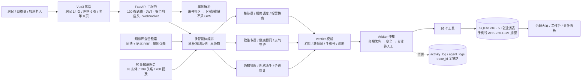

# 智能体创意说明书

> 版本：2026-09-14 定稿（与代码库实时对齐，所有数字可用 `python scripts/check_claims.py` 复算）
> 赛道：**基层治理** · 申报特别奖：**人文赋能**（适老化 + 数据最小化 + 人机协同留痕）

---

## 一、项目基本信息

### 1. 项目名称

**社区先知 CommunityInsight Agent**（基层治理智能体）

### 2. 团队成员信息表

| 序号 | 姓名 | 身份证号 | 专业 / 学历 | 院校 | 团队职责 | 学生证扫描件 | 备注 |
| ---- | ---- | -------- | ----------- | ---- | -------- | ------------ | ---- |
| 1    | 步承泽 | 110113200604194512 | 大数据管理与应用 / 本科 | 北京工商大学 | 项目负责人（架构设计 / Agent 内核 / 全栈开发 / 数据与测试） | （附件待附） | 单人参赛，独立完成 |

> 本项目为**单人参赛**（2-5 人组队允许范围内独立完成全部研发工作）。

### 3. 参赛方向（勾选）

- [ ] 产业赋能
- [ ] 政企服务
- [x] **基层治理**
- [ ] 文创艺术
- [ ] 科教创新

### 4. 项目负责人信息

- 姓名：步承泽
- 联系电话：15313950893
- 电子邮箱：1803801843@qq.com

---

## 二、项目概述（≤300 字）

基层"接诉即办"有三个长期痛点：**诉求处理不透明**（上报后无人跟进、进度不可见）、**时效无保障**（无分级与超时预警）、**独居老人安全真空**（失联数日只能靠邻居偶然发现）。

本项目是**多智能体协同的社区治理 Agent**：感知层定时监测工单热点、极端天气与老人活跃度；理解层先用确定性规则识别诉求（同义词/方言归一），模糊时由大模型闭集兜底；协作层由 **9 个声明式角色在黑板上多轮真协商**（如"极端天气 → 健康顾问 → 通知管理员"），调用 **16 个工具**；反馈层每轮必过 **Verifier（幻觉/诊断/隐私拦截）+ Arbiter（合规优先·安全·专业·转人工）双层防线**并全程留痕。三端差异化服务：居民一句话上报并追踪闭环、网格员处理 SLA 工单、老人用大字关怀版一键呼叫与 SOS。

**属地化**是基层治理的领域刚需：政策按行政区划**本地优先、全国兜底**，天气按居民所属社区取数——**属地来自账号网格归属，不采集任何设备位置**。

---

## 三、智能体架构与技术实现（核心）

### 1. 整体架构逻辑

**① 架构范式：多智能体协作（非单 Agent 套壳）**

主干为 **OODA 自主循环**（Observe→Orient→Decide→Act→Reflect），叠加**角色化多智能体分工 + 黑板消息队列真协商**：角色之间通过 `task_request / task_response / notify / error / handoff` 五类消息在共享黑板上往返，**一次用户输入可以触发多轮跨角色协商并改变执行链**（不是"把 9 个 prompt 串起来"）。

**② 核心模块（六层 + 交互层）**

| 层 | 模块 | 职责 | 代码位置 |
|----|------|------|---------|
| 感知层 | 天气守护 / 网格助手 / 关怀巡检 | 天气与预警、工单热点、老人活跃度与久未互动、SLA 超时升级（定时任务） | `agent/roles/auto_agents.py`、`scripts/scheduler.py` |
| 理解层 | 接待员（规则为骨 + LLM 兜底） | 同义词/方言归一 + 指代与否定处理；模糊时 LLM 闭集兜底 | `agent/roles/business_agents.py`、`agent/intent_llm.py` |
| **属地层** | **地区识别（属地化）** | 由账号所属社区解析属地链（社区→区→市→省）；政策属地优先、天气按社区城市；**不采 GPS** | `utils/region.py`、`data/db_policy.py` |
| 协作层 | 黑板 + 编排器 | 9 个声明式角色共享黑板收发消息，多轮真协商；锁 + 版本 + 历史（封顶 500） | `agent/blackboard.py`、`agent/orchestrator.py` |
| 决策层 | 业务角色（5）+ 专家角色（4） | 报修调度、提案协商、政策专员、健康顾问、通知管理、天气守护、网格助手、合规审计、接待员 | `agent/roles/` |
| 执行层 | **16 个工具（自动发现 + 按角色裁剪）** | 上报/查询工单、我的工单、派单、提案与附议、议题、天气、社区脉搏、治理统计、知识库问答 | `tools/` |
| 反馈层 | **Verifier + Arbiter 双层防线** | 幻觉/敏感词/完整手机号/医疗诊断句式拦截 → 合规优先·安全·专业·转人工，决策落 `agent_logs` | `agent/verifier.py`、`agent/arbiter.py` |
| 交互层 | **Vue3 三端** | 居民端 14 页 / 网格端 9 页 / 老年端 8 页（大字高对比 + 语音 + TTS + 免登录） | `web/src/views/{resident,grid,elderly}/` |

**③ 整体运行逻辑与数据流向**

```
用户输入 → 上下文注入（属地 / 天气 / 热点 / 会话实体）
        → 接待员识别意图（同义·方言归一 → 规则优先 → LLM 闭集兜底）
        → 编排器派发到对应角色；黑板消息队列驱动跨角色多轮协商
        → 角色调用治理工具写 SQLite（工单/提案/派单/通知/关怀记录）
        → Verifier 校验（幻觉/敏感词/手机号/诊断）→ Arbiter 仲裁（必要时转人工）
        → 主动闭环（未解决提醒 / 老人未打卡预警 / SLA 升级 / 办结回访）
        → 回复（文本 / TTS 播报）+ trace_id 全链路留痕
```

### 2. 智能体工作流设计

**① 输入源（合规说明）**

| 输入源 | 说明 | 合规 |
|--------|------|------|
| 文本 | 居民自然语言诉求与对话 | 演示库为**虚构种子数据**，无真实个人信息 |
| 语音 | 老年端浏览器语音识别 → 文本 | 浏览器本地识别，不上传音频；**https 下可用，否则自动降级为打字 + 预置短语** |
| 知识库 | 社区政策 / 指南 | **62 条（61 已发布）**，其中 **55 条为公开权威政策摘要（可溯源）** |
| 感知数据 | 工单表 / 天气 API / 老人活跃度 | 天气用和风天气公开 API（免费授权） |
| **属地** | 账号所属社区（`user_profile.community`） | **不使用 GPS/IP 定位** → 符合数据最小化 |

**② 处理流程**

- **大模型选型**：DeepSeek（OpenAI 兼容）。**默认"规则为骨、LLM 为脑"**：意图、状态机、权限、风控、脱敏全部走确定性规则；LLM 只用于模糊意图兜底、政策生成与跨角色协商。四项能力开关（`LLM_ORCHESTRATION` / `POLICY_LLM_RAG` / `RECEPTION_LLM_FALLBACK` / `LLM_NEGOTIATION`）可一键开关。
  实测代价：**每轮对话约 +0.9 秒 / +¥0.0002**（真实调用，`llm_usage` 可查）。
- **提示词工程**：系统提示注入角色上下文与工具原则；LLM 输出走**闭集校验**（意图白名单、引用下标必须落在检索片段内、协商目标必须在 6 个可联动角色白名单内）。
- **知识库构建**：59→**62 条**知识条目；**词法（同义词/方言扩展）+ 语义向量（text-embedding-v3, 1024 维）混合检索 + RRF 融合**。
- **检索质量**：**48 条口语金标 hit@1 = 100%**（纯词法基线 85.7%），含 6 条属地用例（属地 Top-1 4/4）。
- **属地化检索**：`applicable_area` 归一（支持"北京市海淀区"这类复合串）→ 本地条目加分、**全国条目永不过滤**（兜底）；**属地只影响"选谁"，绝不改变"能不能自动回答"的阈值**（安全底线有专门测试）。
- **工具调用**：自研多智能体编排（9 角色 + 黑板真协商 + 16 工具 + 角色化工具裁剪）。
- **自动化节点**：感知周期触发 → 自动派单 → SLA 升级 → 老人平安打卡检测 → 办结回访。

**③ 输出形态**

对话文本 / TTS 语音播报 / 工单与提案落库 / 状态流转与派单指令 / 天气与属地标签 / 治理看板与 KPI 图表 / 全链路留痕（`activity_log` + `agent_logs`）。

**④ 架构图**



### 3. 人机协同边界设计

**① 智能体自动执行**：意图识别、工单分类与紧急度评估、部门/网格派单、提案状态流转、通知分级草稿、政策问答（带引用）、天气与健康提示、老人未打卡预警、SLA 超时升级。

**② 必须人工确认（人在环）**：
- **健康建议涉及"需线下就医"** → 二次确认后才下发；
- **医疗诊断类 / 法律纠纷类提问** → 系统不自动回答，直接转人工；
- **提案不予执行、违规下架、批量操作** → 需负责人确认并留痕；
- **紧急求助（SOS）** → 仅通知联系人与社区，**不自动拨打 110/120**；
- **政策弱命中** → 转人工（或 LLM 生成但**引用必须校验通过**，否则回退转人工）。

**③ 全程可追责**：每次仲裁决策、每轮协商消息、每次拦截都落库；管理端可查"处理留痕"时间线。

### 4. 架构创新点

1. **真协商而非流水线**：黑板消息队列 + 多轮链式消费 + 循环防护（单目标 2 轮 / 总 5 轮上限），协商能**改变执行链**（天气预警会真的把工单升级并生成通知草稿）。
2. **双层防线可解释**：Verifier 负责"内容安全与幻觉"，Arbiter 负责"合规优先级的冲突裁决"，两者决策都留痕，可现场投屏复算。
3. **属地化不越界**：属地只作**排序信号**，不作准入门槛；全国政策永远兜底；**不采集位置**——既是合规选择，也是基层治理的真实工作方式（人属于哪个网格是确定的）。
4. **规则与 LLM 显式分层**：把"哪些必须用 LLM（开放式诉求意图、政策生成、跨角色联动）、哪些该留规则（状态机、权限、脱敏、风控）"写成代码里的开关与分级函数，而不是口号。
5. **质量可现场复算**：625 项测试、54 个页面视口的客观视觉审计、21 页真机口径移动审计、12 项真实 HTTP 端到端验收、公开数字一致性门禁——**每一项都能当场跑给你看**。

---

## 四、产业 / 场景应用说明

### 1. 精准应用场景（垂直细分）

**城市社区 / 街道的"接诉即办"日常治理**，尤其是**老龄化程度较高、网格员人手紧张的老旧小区**。典型用户：① 居民（尤其不会用 App 的中老年居民）；② 网格员（一人管多网格、靠微信群和纸笔）；③ 独居/高龄老人及其家属。

### 2. 目标问题与现有方案痛点

| 现有做法 | 痛点 | 本项目怎么解 |
|---|---|---|
| 微信群上报 + 人工台账 | 消息沉底、无状态、无法追责 | 一句话自动生成工单，状态机 + 留痕 + 时限 |
| 政务 App / 小程序 | 表单冗长、老年用户放弃；地区政策混在一起 | 三端差异化；**NLU 口语/方言归一**；政策**属地优先** |
| 通用大模型直接答政策 | 幻觉、政策过期、地区不符 | 强制引用 + Verifier/Arbiter + 弱命中转人工 + 属地优先/全国兜底 |
| 老人关怀靠定期上门 | 空档期长、异常发现晚 | 活跃度巡检 + 未打卡预警 + 大字 SOS + 家属绑定 |

### 3. 智能体提效 / 降本 / 提质 / 风控价值

- **提效**：诉求从"看到消息→手工登记→口头转派"变为"一句话→自动分类/派单/通知"，全流程线上留痕。
- **降本**：**规则优先 + LLM 按需**，日常诉求零 LLM 成本；实测 LLM 单轮约 **¥0.0002**（30 次调用合计 ¥0.0069，含开发期探测，可现场查 `llm_usage`）。
- **提质**：政策问答**强制引用**可溯源（"依据：XX 政策（V1）"），弱命中转人工而非硬答；SLA 分级与超时升级。
- **风控**：手机号等敏感字段**加密落库 + 展示脱敏**；医疗/法律类不自动回答；敏感词与完整手机号在输出前拦截；所有 AI 决策留痕可审计。

### 4. 适配区域 / 社区落地路径

1. **单社区试点（最小可用闭环）**：报修 + 通知 + 政策问答 + 适老 SOS 四项先跑通，用真实工单验证"平均受理时长 / 一次派单成功率 / 回访满意度"三个指标；
2. **多社区接入**：属地映射表（`REGION_BY_COMMUNITY`）从配置迁到 `community_regions` 表，租户维度隔离（代码已预留 `tenant_id`，**当前仅 3 张主表预留、查询层未隔离**——见"已知边界"）；
3. **与街道现有系统对接**：12345 / 街道工单系统的字段映射（**当前未对接**，接口层已预留）。

---

## 五、可运行性与落地可行性

### 1. 原型状态

**可运行的完整原型（演示级）**：`uvicorn api_web:app --port 8000` 一条命令起服务，首次启动自动迁移到 **schema v46** 并灌演示种子数据（约 15 秒）；三端功能闭环可现场操作；已有公网 HTTPS 演示入口（本机 + Cloudflare 临时隧道，**演示结束一键关闭**）。

### 2. 已完成验证（全部实跑，命令可现场复算）

| # | 验证项 | 命令 | 实测结果 |
|---|---|---|---|
| 1 | 功能与回归 | `python -m pytest tests/ -q` | **624 通过 / 1 跳过 / 0 告警**（可运行 625） |
| 2 | 端到端验收（真实 HTTP） | `python scripts/demo_acceptance.py` | **12/12 全过** |
| 3 | 演示前一键自检 | `python scripts/demo_preflight.py` | **9/9 通过** |
| 4 | UI 与无障碍客观审计 | `python scripts/ui_audit.py` | **54 个页面/视口 × 9 类检查 0 违规**（对比度/溢出/热区/字号/暗色/动效/残缺文本） |
| 5 | 移动端真机口径审计 | `python scripts/mobile_audit.py` | **21 页 × 7 类检查 0 违规**（iOS 聚焦放大/底栏遮挡/横屏/安全区） |
| 6 | 检索质量 | `python scripts/rag_eval.py` | **48 条金标 hit@1 100%**（纯词法 85.7%；属地用例 Top-1 4/4） |
| 7 | 数据安全 | `python scripts/audit_phone_encryption.py` | 8 张含手机号表 **明文计数 0** |
| 8 | 代码规范 | `python -m ruff check .` | **0 错误** |
| 9 | 前端构建 | `cd web && npm run build` | 构建成功 |
| 10 | 数字一致性 | `python scripts/check_claims.py` | 材料数字与代码实时一致 |
| 11 | 公网入口可用性 | `python scripts/probe_public.py` | **8/8**（评委手机扫码可进入，含智能体对话） |
| 12 | 门禁有效性（故障注入） | 见 `docs/spec/dev-log.md` 四十七节 | **8 次注入 8 次被门禁拦下** |

### 3. 核心技术栈与依赖工具

- 后端：**Python 3.12 + FastAPI**（130 条路由）· 数据层：**SQLite（WAL，schema v46，50 张业务表）**，迁移走版本化注册表（禁止运行时裸 ALTER）· 前端：**Vue3 + Vite + Naive UI**（三端）· LLM：DeepSeek（可关）· 嵌入：阿里云百炼 `text-embedding-v3`（1024 维）· 天气：和风天气公开 API · 密码学：`cryptography`（AES-256-GCM）· 测试与审计：pytest + Playwright。
- **依赖克制**：JWT、加密调用封装、聚类、DNS 兜底解析等均以标准库实现，避免第三方锁定。

### 4. 落地所需条件

| 项 | 要求 | 当前状态 |
|---|---|---|
| 算力 | 1 台能跑 Python 的机器（演示级 2 核 4G 足够）/ 或云服务器 | ✅ 本机已跑通 |
| 数据库 | 单社区 SQLite 足够；多社区需 PostgreSQL | ⚠️ 迁 PG 仅有方案与路径 |
| LLM | DeepSeek API Key（可选，无 Key 自动降级纯规则） | ✅ 已接 |
| HTTPS | 老年端语音与"添加到主屏幕"需要 https | ✅ 临时隧道 https；⚠️ 正式域名+证书未部署 |
| 人工兜底 | 至少 1 名网格员/社区工作人员处理转人工事项 | 试点必备 |

### 5. 风险点与应对方案

| 风险 | 应对（已做 / 计划） |
|---|---|
| 政策答错误导居民 | 强制引用 + Verifier 校验 + 弱命中转人工；**属地优先但不屏蔽其他地区** |
| 老年端语音在部分浏览器不可用 | 页面给出**打字 + 预置短语**降级路径；答辩现场真机演示并说明边界 |
| AI 越权代替人决策 | 明确"人在环"清单（就医建议/SOS/不予执行/批量操作必须人工确认） |
| 隐私与合规 | 不采位置、手机号加密、展示脱敏、留痕不含完整手机号；医疗/法律不自动回答 |
| 单机扩展性 | **当前仅支持单进程**（黑板/限流/WebSocket 在进程内）；扩容路径已写进 `docs/scaling.md` |
| 无真实试点数据 | **如实声明**：当前验证集中在"机制可验证"，治理成效需试点验证（见下） |

---

## 六、合规与知识产权

### 1. 数据来源与合规说明

- **演示数据为虚构种子数据**：工单 225 条、提案 201 条、通知 6 条均为程序生成的演示数据，**不含任何真实居民信息**；
- **政策语料为公开政策摘要**（55 条，可溯源到发布机关），仅作检索与引用演示；
- **不采集设备位置**：属地来自账号所属社区（网格归属）；不使用 GPS / IP 地理库；
- **个人信息保护**：手机号等敏感字段 **AES-256-GCM 加密落库**（密文带算法版本前缀），列表/日志**脱敏展示**，8 张含手机号表**明文计数 0**（可脚本复算）；日志留痕不含完整手机号；
- **AI 输出治理**：敏感词、完整手机号、医疗诊断句式在输出前拦截；医疗/法律类提问不自动回答；合规审计员角色对每轮输出做脱敏与留痕检查。

### 2. 第三方资源授权情况

| 资源 | 用途 | 授权/来源 |
|---|---|---|
| DeepSeek API | LLM 能力（可关闭） | 商业 API，按量付费（个人 Key） |
| 阿里云百炼 text-embedding-v3 | 语义向量 | 商业 API（个人 Key） |
| 和风天气 API | 天气数据 | 官方免费额度 |
| 公开政策文本 | 知识库语料 | 政府公开发布信息（标注来源与发布机关） |
| 开源依赖 | FastAPI / Vue3 / Naive UI 等 | MIT / Apache-2.0 等宽松许可 |

### 3. 知识产权规划

- 代码与文档为团队原创；**鼓励开源（MIT）**用于教学与公益场景，商标/名称保留；
- 不涉及专利主张；引用政策文本仅作摘要与索引，不生成长篇原文复制。

---

## 七、附件材料

| 附件 | 位置 | 说明 |
|---|---|---|
| 最终版交付说明 | `docs/competition/最终版交付说明.md` | 5 分钟跑起来 / 怎么验证 / 已知边界 / 答辩速答 |
| 技术实现报告 | `docs/competition/技术实现报告.md` | 架构与实现细节（与本说明书口径一致） |
| 答辩问答手册 | `docs/competition/答辩问答手册.md` | 25 问 + 加分话术 / 避坑话术 + 证据命令 |
| 演示脚本 / 录屏分镜 | `docs/competition/演示脚本.md`、`答辩录屏分镜.md` | 现场演示流程与兜底视频 |
| 开发日志（48 节） | `docs/spec/dev-log.md` | 每轮"问题→修复→证据"，含未修复项与理由 |
| 外部复审报告与回执 | `docs/review/` | 10 轮独立复审 + 逐条处理回执 |
| 移动端 / 常开方案 | `docs/mobile-deploy.md`、`docs/演示常开-本机方案.md` | 手机访问与 0 成本公网演示 |
| 属地化方案 | `docs/spec/地区识别落地方案.md` | 属地化设计 v2（含安全底线与不做清单） |

> **一句话定位**：这是一个**工程完成度高、可现场复算、但尚无真实试点数据**的基层治理多智能体原型——
> 我们选择把"可验证"做成核心能力，而不是把"成效"讲成已完成的事实。
